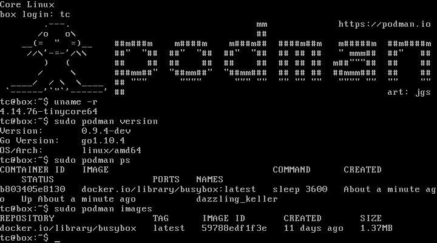

# boot2podman

Boot2podman is a lightweight Linux distribution made specifically to run
**Podman** containers. It runs completely from RAM, is a
~75MB download.

## Features

* Recent Linux Kernel, Podman pre-installed and ready-to-use
* VM guest additions (VirtualBox, Parallels, VMware, XenServer)
* Container persistence via disk automount on `/var/lib/containers`
* SSH keys persistence via disk automount _(coming soon)_

### Podman

Podman is a command line tool that allows for full management of a container's lifecycle from creation
through removal. It supports multiple image formats including both the Docker and OCI image formats.
Support for pods is provided allowing pods to manage groups of containers together.

### Buildah

The Buildah project provides a command line tool that be used to create an OCI or traditional Docker
image format image and to then build a working container from the image.  The container can be mounted
and modified and then an image can be saved based on the updated container.

## Details

* Linux 4.14, with support for `cgroupfs`and `overlayfs` configured
* [Podman](https://podman.io/) and its dependencies like: `runc`, `conmon`, `cni-plugins`
* [Varlink](https://varlink.org) support for running remotely (being tunneled over SSH)
* [Buildah](https://buildah.io/) support for building container images without daemon

## Download

ISO can be found in: https://github.com/boot2podman/boot2podman/releases

## Sample session

Here showing a simple login session, from an early development version:



## Artwork

The boot2podman logo is based on the original [podman](https://github.com/containers/libpod) logo and the [Montserrat](https://github.com/JulietaUla/Montserrat) font.

The text logo is based on http://ascii.co.uk/art/seal and `figlet -f ascii12 podman`.

## Installation

Currently based on [CorePure64-9.0.iso](http://www.tinycorelinux.net/9.x/x86_64/release/CorePure64-9.0.iso), but with a [custom kernel](custom_kernel.md) (4.14.10 -> 4.14.76)

We need support for `cgroupfs` (including "memory") and for `overlayfs` (on ext4).

``` txt
CONFIG_MEMCG=y
CONFIG_OVERLAY_FS=y
```

We install the required `go` compiler environment by [building from source code](building_go.md).

Then we install `podman` and other dependencies by [building from source code](building_podman.md).

* runc
* conmon
* cni-plugins
* cgroupfs-mount

The `varlink` command line tool can be installed by [building from source code](building_varlink.md).

We can also add `buildah` and its dependencies, by [building from source code](building_buildah.md).

## Packages

Here are the binary packages that are produced, after building from source code.

### Build

These packages are used for building:

* [compiletc.tcz](http://www.tinycorelinux.net/9.x/x86_64/tcz/compiletc.tcz) 54M*
  * gcc.tcz
  * glibc_base-dev.tcz
  * make.tcz
  * pkg-config.tcz
  * ...
* [git.tcz](http://www.tinycorelinux.net/9.x/x86_64/tcz/git.tcz) 5.7M*
* [go.tcz](https://dl.bintray.com/boot2podman/tinycorelinux/9.x/x86_64/tcz/go.tcz) 75M*

\* total size, including dependencies (see .tree and .dep)

### Runtime

These packages are used at runtime:

* [podman.tcz](https://dl.bintray.com/boot2podman/tinycorelinux/9.x/x86_64/tcz/podman.tcz) 11M
  * runc.tcz 2.8M
  * conmon.tcz 24K
  * cni-plugins.tcz 17M
  * ...
* [varlink.tcz](https://dl.bintray.com/boot2podman/tinycorelinux/9.x/x86_64/tcz/varlink.tcz) 44K
* [buildah.tcz](https://dl.bintray.com/boot2podman/tinycorelinux/9.x/x86_64/tcz/buildah.tcz) 6M
  * runc.tcz
  * cni-plugins.tcz
  * ...

## Configuration

The software does not work after installation, without some mandatory registries and policies config done.

[/etc/containers/registries.conf](files/containers/registries.conf)
``` toml
[registries.search]
registries = ['docker.io', 'quay.io']

[registries.insecure]
registries = []
```

[/etc/containers/policy.json](files/containers/policy.json)
``` json
{
    "default": [
        {
            "type": "insecureAcceptAnything"
        }
    ]
}
```

We need to make sure to use "cgroupfs" (not systemd) and to disable "pivot_root" (to run under tmpfs).

[/etc/containers/libpod.conf](files/containers/libpod.conf)
``` toml
# CGroup Manager - valid values are "systemd" and "cgroupfs"
cgroup_manager = "cgroupfs"

# Whether to use chroot instead of pivot_root in the runtime
no_pivot_root = true
```
Location of the configuration is currently hard-coded to `/etc/containers`, so it is not included in tcz...

### Persist data

Boot2podman uses [Tiny Core Linux](http://tinycorelinux.net), which runs from
RAM and so does not persist filesystem changes by default.

### Inspiration

Boot2podman is inspired by [Boot2Docker](https://github.com/boot2docker/boot2docker), which is
a similar solution but for another popular container runtime.
